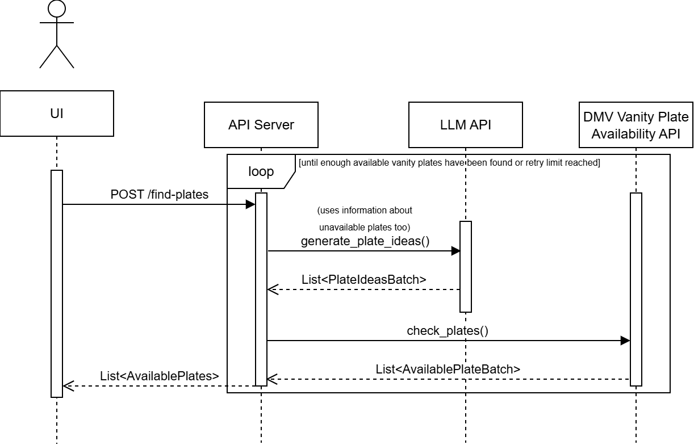

# ai_project

Project repository for ECE570.

This project generates vanity plate ideas with an LLM, checks which ones are available, and returns a curated list through a FastAPI endpoint.

## Environment Setup and Quick Start

### 1. Create and activate a virtual environment

Install and use Python 3.14.2 or above.

From the project root:

```bash
python -m venv .venv
.venv\Scripts\Activate.ps1
```

### 2. Install Python dependencies

From the project root:

```bash
pip install -r requirements.txt
```

Dependency list file:

- [requirements.txt](./requirements.txt)

### 3. Configure the API key

Create a `.env` file in the project root and add the following value. You can get an API key from [Google AI Studio](https://aistudio.google.com/):

```bash
GEMINI_API_KEY=your_api_key_here
```

### Start the backend

```bash
cd src
uvicorn api:app --reload
```

The API docs are available in the browser at http://127.0.0.1:8000/docs.

To try an example REST API call with a custom vanity plate prompt, open `POST /find-plates` in the docs, select `Try it out`, edit the `description` value, and click `Execute`. After a few seconds, the response body will display the vanity plate ideas.

#### Demo UI

The demo UI described in the paper is more complicated to run on another device and was not built for deployment. The Retool UI can be imported using the [VanityPlateFinderDemo.json](retool\VanityPlateFinderDemo.json) file. For further instructions or a personal demo, please reach out to the developer at dlobenst@purdue.edu.

## Architecture Diagram

The overall design is shown below:



Read the diagram from left to right:

1. The UI sends `POST /find-plates` to the API server.
2. The API server enters a loop that tries to find enough available candidates.
3. The API server requests a batch of plate ideas from the LLM API (`generate_plate_ideas()`).
4. The API server sends that batch to the plate checker (`check_plates()` in concept, implemented as `check_dummy_availability()` in the current code).
5. The checker returns available and unavailable batches.
6. The API server repeats the loop until it has enough available plates or reaches the retry limits.
7. The API server returns `List<AvailablePlates>` to the UI.

## Code Walkthrough

### 1. API layer: request validation and orchestration

File: [src/api.py](./src/api.py)

Responsibilities:

- Defines the FastAPI app and the `POST /find-plates` endpoint.
- Defines the request schema with `PlateRequest` for description, desired count, and min/max lengths.
- Loads state-specific constraints and retry settings from `config/california_config.json`.
- Validates user input before calling the generation and checking pipeline.
- Returns the final available plate list as JSON.

Key behavior:

- Rejects `amount_available_plates` above the configured maximum.
- Rejects length bounds outside the state limits.
- Calls `PlateFinder.find_available_plates(...)` with config-driven parameters.

### 2. LLM adapter: idea generation and iterative search

File: [src/llm_adapter.py](./src/llm_adapter.py)

Responsibilities:

- Wraps Gemini client setup (`PlateFinder`).
- Generates plate candidate batches with prompt instructions.
- Runs a retry loop to accumulate enough available plates.
- Decreases rarity over time to broaden the candidate search.

Main methods:

- `find_available_plates(...)`
  - Computes batch size as `amount_available_plates * amount_of_ideas_multiplier`.
  - Tracks `available` and `not_available` to reduce repeats.
  - For each iteration, it generates candidate ideas from the LLM, checks availability via `PlateGetter`, merges results, reduces rarity, and stops on success or after the maximum number of tries.
  - This method corresponds directly to the loop shown in the diagram.
- `generate_plate_ideas(...)`
  - Called inside `find_available_plates(...)`.
  - Builds a full prompt from the base prompt, user description, and constraints.
  - Calls the Gemini model and parses comma-separated results.
  - Retries on timeout-like failures.

### 3. Plate availability checker

File: [src/plate_checker_dummy.py](./src/plate_checker_dummy.py)

Responsibilities:

- Provides the dummy availability-checking interface used by `PlateFinder`.
- Contains two implementations:
  - `check_dummy_availability(...)`: simulated checker, currently the active path.
  - `check_plate_availability(...)`: DB-assisted path for real or background updates; this is not active right now, see the code comments. (This part is intended to use a previous project of mine, the commented code is from that project as well.)

Current runtime path:

- `check_dummy_availability(...)` simulates availability using randomness and length filtering.

Intended production path:

- In architecture terms, this is the placeholder for the DMV Vanity Plate Availability API lane.
- The method can be replaced with the production API lane with minimal changes to the rest of the project.

### 4. Configuration as control plane

File: [config/california_config.json](./config/california_config.json)

The API and loop behavior are tuned through config values:

- `min_len_state`, `max_len_state`: legal character bounds.
- `starting_rarity`: first-pass strictness and creativity setting for generation.
- `max_amount_plates`: upper limit accepted from API callers.
- `max_tries`: loop safeguard that stops searching after N iterations.
- `amount_of_ideas_multiplier`: batch-size scale per iteration.

This lets you tune quality, speed, and API cost without changing code.

## End-to-End Flow

1. The user provides a description, for example: “clean, sporty, short”, length 3-5 characters, and 5 different options.
2. The UI calls `POST /find-plates`.
3. `api.py` validates the request using the state config limits.
4. `PlateFinder` asks Gemini for a candidate batch.
5. The candidate batch is checked for availability.
6. Available candidates are accumulated, and checked candidates are tracked to avoid repeats.
7. If not enough candidates are available, rarity is adjusted and the loop repeats.
8. The final list of available plates is returned to the UI.

## Notes

- The environment variable required by `PlateFinder` is `GEMINI_API_KEY`.
- The current checker path is simulated; replacing or wiring `check_plate_availability(...)` to a live DMV source completes the rightmost part of the diagram.


## Disclaimer:
Text in this README file has been improved using an LLM. Used Prompt: "Improve this README file, without changing its content - improve the formatting and the text itself. Give me the raw md code."